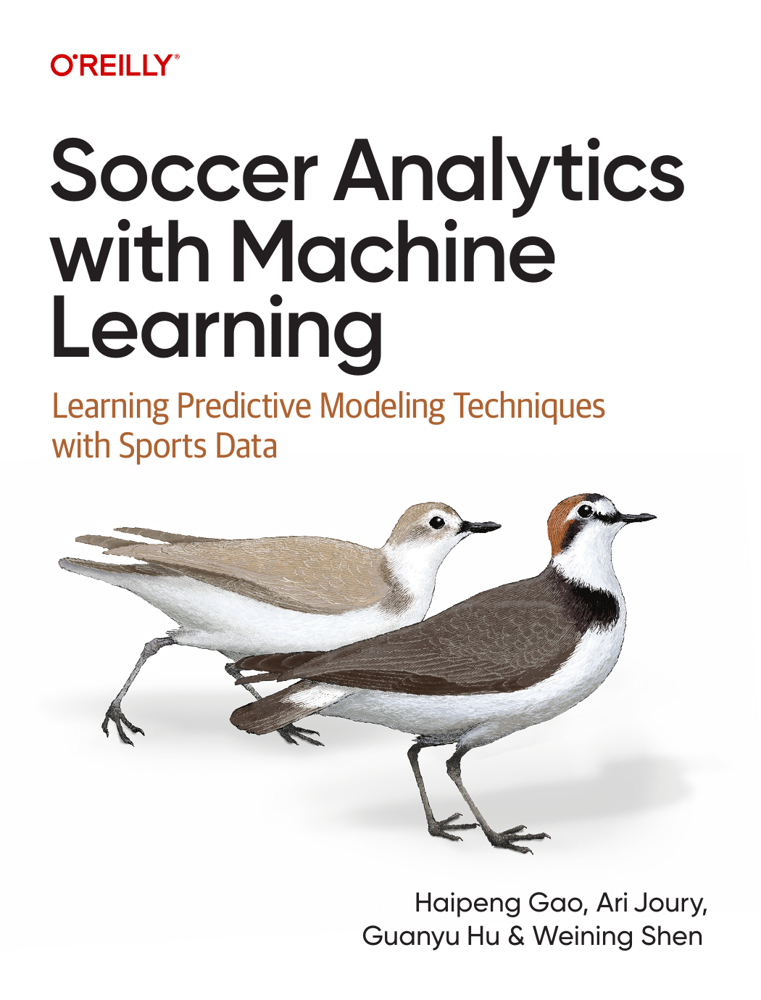

# Companion Code for <a href="https://learning.oreilly.com/library/view/soccer-analytics-with/9781098181109/" target="_blank" rel="noopener noreferrer"><em>Soccer Analytics with Machine Learning</em> (O'Reilly)</a>

<a href="https://opensource.org/licenses/MIT" target="_blank" rel="noopener noreferrer"></a>

This is the the official companion code repo for the book <a href="https://learning.oreilly.com/library/view/soccer-analytics-with/9781098181109/" target="_blank" rel="noopener noreferrer"><em>Soccer Analytics with Machine Learning</em> (O'Reilly)</a>. It provides all the Jupyter Notebooks and supplementary materials needed to follow along with the examples and exercises in the book.

## About the Book

_Soccer Analytics with Machine Learning_ is a practical guide to soccer analytics, designed for both data scientists who want to apply their skills to the beautiful game and soccer enthusiasts who want to learn about data analysis. The book covers everything from the fundamentals of Python and data wrangling to advanced machine learning models for predicting match outcomes and evaluating player performance.

### Where to Get

<table border="1" cellspacing="0" cellpadding="6">
  <tr>
    <td>
      <a href="https://learning.oreilly.com/library/view/soccer-analytics-with/9781098181109/" target="_blank" rel="noopener noreferrer">
        
      </a>
    </td>
  </tr>
</table>

- <a href="https://www.amazon.com/Soccer-Analytics-Machine-Learning-Predictive/dp/1098181115" target="_blank" rel="noopener noreferrer"><strong>Amazon</strong></a>
- <a href="https://learning.oreilly.com/library/view/soccer-analytics-with/9781098181109/" target="_blank" rel="noopener noreferrer"><strong>O'Reilly</strong></a>

### Authors

- **Haipeng Gao**: <a href="https://www.hpgao.com/" target="_blank" rel="noopener noreferrer">Website</a> | <a href="https://www.linkedin.com/in/haipenggao/" target="_blank" rel="noopener noreferrer">LinkedIn</a>
- **Ari Joury**: <a href="https://www.linkedin.com/in/arijoury/" target="_blank" rel="noopener noreferrer">LinkedIn</a> | <a href="https://www.linkedin.com/in/arijoury/" target="_blank" rel="noopener noreferrer">LinkedIn</a>
- **Guanyu Hu**: <a href="https://sites.google.com/site/nealguanyu/" target="_blank" rel="noopener noreferrer">Webiste</a> | <a href="https://www.linkedin.com/in/guanyu-hu-824037117/" target="_blank" rel="noopener noreferrer">LinkedIn</a>
- **Weining Shen**: <a href="https://faculty.sites.uci.edu/weinings/" target="_blank" rel="noopener noreferrer">Webiste</a> | <a href="https://www.linkedin.com/in/weining-shen-22611728/" target="_blank" rel="noopener noreferrer">LinkedIn</a>

## Repository Structure

This repository is organized to mirror the structure of the book, making it easy to find the code for each chapter.

```
soccer-analytics-book/
├── README.md                          # Main landing page with overview
├── LICENSE                            # License information
├── requirements.txt                   # Python dependencies
├── .gitignore                         # Git ignore file
│
├── notebooks/                         # Main content directory
│   ├── chapter-02/                    # Python Basics
│   ├── chapter-03/                    # Data Wrangling
│   └── ...                            # And so on for each chapter
│
├── extras/                            # Additional resources
│   ├── extended-examples/             # Beyond-the-book examples
│   └── solutions/                     # Exercise solutions
│
└── docs/                              # Documentation
    └── setup.md                       # Installation guide
```

## Quick Start

You can work through the notebooks in one of two ways:

1. Run them locally with Jupyter.
2. Open them in Google Colab.

### Option 1: Run Locally

If you want to run the notebooks on your own machine, install Python 3.8+ first, then clone the repo and install the dependencies:

```bash
git clone https://github.com/SoccerAnalyticsML/Soccer-Analytics-with-Machine-Learning.git
cd Soccer-Analytics-with-Machine-Learning
pip install -r requirements.txt
jupyter notebook
```

Then open any notebook under `notebooks/` or `extras/`. A good place to start is:

`notebooks/chapter-2/01-python-setup-and-basics.ipynb`

For a more detailed local setup guide, see <strong><a href="docs/setup.md" target="_blank" rel="noopener noreferrer">Setup Documentation</a></strong>.

### Option 2: Use Google Colab

If you prefer not to install anything locally, you can run the notebooks in Google Colab:

1. Open <a href="https://colab.research.google.com/" target="_blank" rel="noopener noreferrer">Google Colab</a>.
2. Choose **File > Open notebook > GitHub**.
3. Paste this repository URL:

   `https://github.com/SoccerAnalyticsML/Soccer-Analytics-with-Machine-Learning`

4. Select the notebook you want to run.

If a notebook depends on local files, upload those files to your Colab session or mount Google Drive before running the cells.

## Contact and Support

If you have any questions, find a bug, or have a suggestion for improvement, please open an issue in this repository. We welcome contributions from the community!
